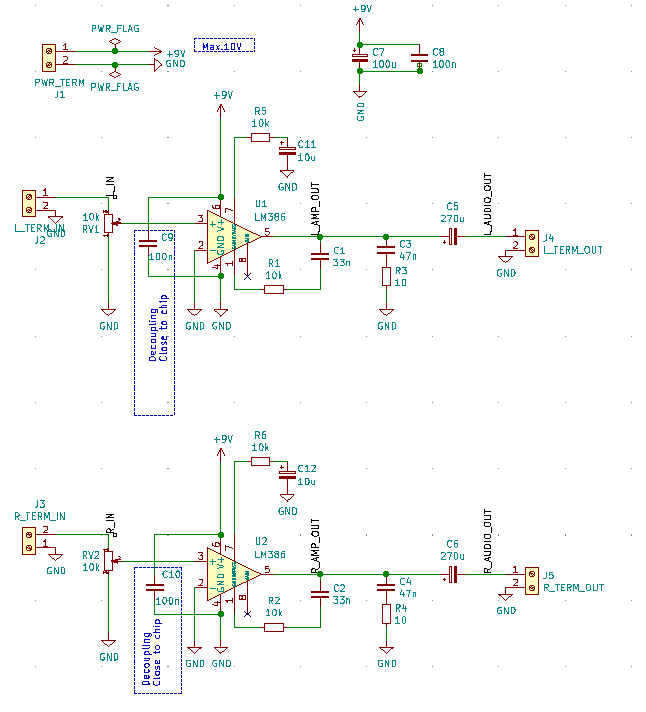
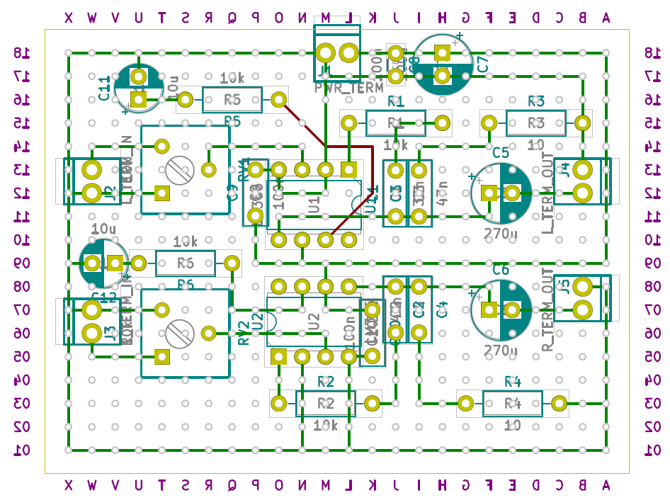

# LM386 Based Audio Stereo Amplifier

This is a simple LM386 based audio amplifier that I can use as a utility amplifier when dealing with audio signals. It is not really a "hifi" amplifier, but produces an acceptable sound on small loudspeakers.

The main purpose of the project though, was to do a [perfboard](https://en.wikipedia.org/wiki/Perfboard) design using [KiCad](https://kicad-pcb.org/). I've usually done the layout design in the past either with paper and pencil or even on the fly directly on the board. The results have not  been good.

## Circuit
The circuit is based strongly on the design shown in [Circuit Basics](https://www.circuitbasics.com/build-a-great-sounding-audio-amplifier-with-bass-boost-from-the-lm386/).

## Layout

One of the main reasons for this project was to see if KiCad could be used to layout the wiring on a perfboard, i.e. soldering bare wires on the back side of the perfboard. The result is shown below:

I set the grid to 2.54mm and then laid out the footprints. I then routed the pins together making sure that each track had only 90 degree turns. Finally I used to array layout function in KiCad to layout the vias. These represent the holes on the perfboard.  

I tried to get all components on the front side of the board with the connections as bare wires on the back side. Unfortunately I made a couple of changes after I had soldered some of the components and wiring, meaning a planar layout I had achieved before was no longer possible. You can see that with the one red (front side) track on the layout. I used an insulated wire, again on the back side, but put some isolation tape between it and the bare wires just to be sure.

Using the KiCad PCB tool meant it was a lot easier to do a clean(er) layout than when I used paper and pencil.
